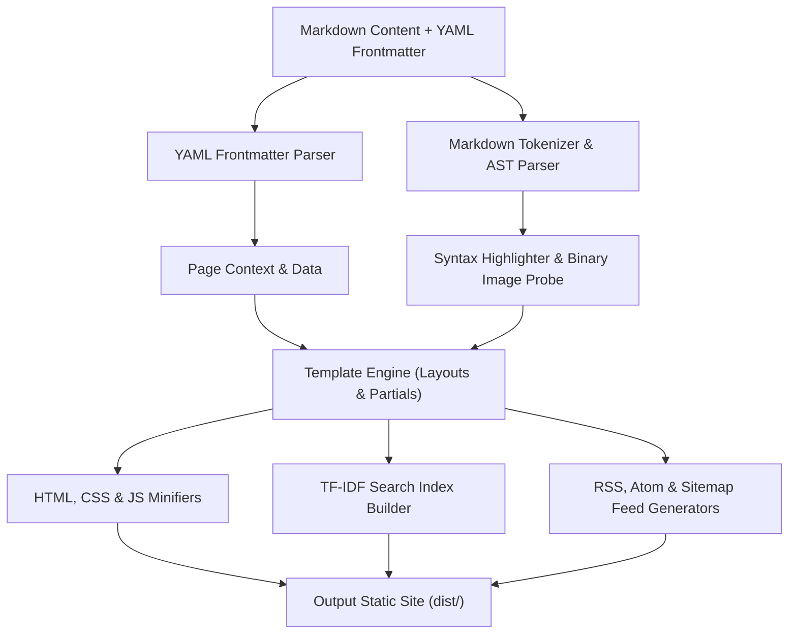

# mysite

**A complete Markdown-to-website generator built with zero third-party dependencies — Node.js standard library only.**

[]()
[](LICENSE)
[]()
[-orange)]()
[]()
[]()

Built for the **Zero Dependency Hackathon** — Track A (Developer Tools & CLI).

---

## The pitch

`mysite` converts a folder of Markdown files into a full website — parsing, templating,
a live-reload dev server, syntax highlighting, full-text search, RSS/Atom/sitemap
feeds, minification, image dimension probing, an accessibility linter, and a broken-link
checker. Every one of those is normally assembled from ten-plus npm packages. This
project hand-rolls all of it, using nothing but Node's built-in `node:` modules.

```json
"dependencies": {},
"devDependencies": {}
```

That's not a placeholder. It's the whole point.

---

## Bonus Challenges Claimed (+11 Points Total)

| Bonus Challenge | Points | Verification / Implementation |
| :--- | :---: | :--- |
| **Reproducible Build** | **+5** | `mysite verify-reproducible` builds site twice and proves byte-identical SHA-256 hashes ([repro-hashes.txt](repro-hashes.txt)). |
| **Package Killer** | **+3** | Reimplemented **`chalk`** (2.6B weekly downloads) in `src/cli/colors.js` using raw ANSI escape sequences. |
| **STDLIB Log** | **+3** | Documented 15 real stdlib-for-package substitutions with detailed trade-off rationales in [STDLIB.md](STDLIB.md). |

---

## Why this exists

In September 2025, an attacker phished the maintainer of `chalk` and `debug` —
combined, packages with billions of weekly downloads — and shipped malicious code
straight into the dependency tree of a huge share of the JavaScript ecosystem. Days
later, the first self-replicating npm worm spread by stealing tokens and republishing
itself into hundreds of other packages. Neither of those attacks required a developer
to make a mistake. They required a developer to run `npm install`.

`mysite` is the counter-argument: build the real thing, with the standard library
you already have, and see how far "the language itself" actually gets you. Further
than you'd think.

---

## Quick start

```bash
git clone <this-repo-url>
cd mysite
npm run build      # builds examples/demo-site → dist/
npm run serve      # dev server with live reload at http://localhost:3000
```

Requires **Node.js 20+** (uses the built-in `node:test` runner).

---

## Command reference

| Command | What it does |
|---|---|
| `mysite build [--src] [--out] [--minify] [--drafts]` | Build a static site |
| `mysite serve [--src] [--port]` | Dev server with SSE live reload |
| `mysite new <name>` | Scaffold a new site |
| `mysite lint [--src]` | Accessibility + broken-link checks |
| `mysite verify-zero-dep` | Prove the manifest and source tree are dependency-free |
| `mysite verify-reproducible` | Build twice, hash both, prove they're identical |

Or via npm scripts: `npm run build|serve|lint|test|verify-zero-dep|verify-reproducible`.

---

## Proof, not promises

Two commands exist purely so a judge doesn't have to take any of this on faith.

**`npm run verify-zero-dep`** scans `package.json` and every source file for anything
that isn't a `node:`-prefixed import, and reports:
```
✓ package.json dependencies: {} (empty)
✓ package.json devDependencies: {} (empty)
✓ scanned 30 source files — 0 non-stdlib imports found
✓ zero third-party runtime dependencies confirmed
```
Full output committed at [`deps-proof.txt`](deps-proof.txt).

**`npm run verify-reproducible`** builds the site twice into isolated output
directories, SHA-256 hashes the full tree of each (sorted, so filesystem
enumeration order can't sneak in nondeterminism), and diffs them:
```
Build 1 hash: 94f69ed94e7ac0f05a3cc585330cc6e343e7c44875cc89ecb065409027b795c0
Build 2 hash: 94f69ed94e7ac0f05a3cc585330cc6e343e7c44875cc89ecb065409027b795c0
✓ builds are byte-identical (deterministic)
```
Full output committed at [`repro-hashes.txt`](repro-hashes.txt).

Both files are regenerated fresh immediately before every submission — if you clone
this repo and re-run either command, you should get the exact same result committed
here.

---

## What's inside

| Subsystem | Replaces | Location |
|---|---|---|
| Markdown parser (tokenizer → AST → renderer) | `markdown-it` / `marked` | `src/markdown/` |
| YAML-subset frontmatter parser | `gray-matter` / `js-yaml` | `src/frontmatter/` |
| Template engine (vars, conditionals, loops, partials, layouts) | `handlebars` / `ejs` | `src/template/` |
| Static file server | `express` / `serve` | `src/server/static-server.js` |
| `fs.watch` + SSE live reload | `chokidar` / `browser-sync` | `src/server/live-reload.js` |
| Syntax highlighter (6 languages) | `highlight.js` / `prismjs` | `src/highlight/` |
| TF-IDF search index + vanilla-JS client widget | `lunr` / `flexsearch` | `src/search/` |
| RSS / Atom / sitemap builders | `feed` / `sitemap` | `src/feed/` |
| HTML/CSS/JS minifiers | `terser` / `csso` / `html-minifier` | `src/minify/` |
| Binary image header parser (PNG/JPEG/GIF/WebP) | `image-size` | `src/media/image-probe.js` |
| Accessibility + broken-link linter | `broken-link-checker` | `src/lint/` |
| argv parser | `commander` / `yargs` | `src/cli/argv.js` |
| ANSI terminal colors — **Package Killer target** | `chalk` | `src/cli/colors.js` |
| Config loader | `cosmiconfig` | `src/config/load.js` |
| Test runner | `jest` / `mocha` | — replaced entirely by Node's built-in `node:test` |

Full detail — what each package normally does, exactly what was built instead, and
the honest trade-offs of doing it ourselves — is in **[STDLIB.md](STDLIB.md)**.

---

## Package Killer: `chalk`

`chalk` is the package named in the September 2025 supply-chain compromise this whole
project is a response to. `src/cli/colors.js` replaces it in about 30 lines: raw ANSI
escape codes, `NO_COLOR` env var support, and a TTY check to auto-disable color in
non-interactive environments (CI logs, piped output). No chaining API, no 24-bit
TrueColor support — 8-color ANSI and basic bold/dim styling covers everything this
tool actually needs. See STDLIB.md for the full write-up.

---

## Honest limitations

We'd rather tell you where the corners are than have you find them:

- **Markdown parser** covers common GFM (headings, tables, lists, blockquotes, code
  fences, emphasis, links, images, autolinks) but isn't 100% CommonMark-spec
  compliant — loose-list paragraph wrapping and raw HTML block passthrough are
  simplified.
- **YAML frontmatter parser** supports scalars, nested maps via indentation, and
  simple lists. No folded multi-line scalars (`|`, `>`), no anchors/aliases, no flow
  mappings (`{a: 1}`).
- **Syntax highlighter** is token-class regex matching, not a real language grammar —
  good enough for readable code blocks, not a replacement for an IDE.
- **JS minifier** strips comments and whitespace only. No AST-based symbol mangling —
  deliberately, to avoid silently breaking scope bindings.
- **Search** is TF-IDF exact-token matching. No fuzzy/typo-tolerant matching.
- **Link checker** issues real HTTP HEAD requests to external URLs but won't get past
  bot-detection/CAPTCHA on sites that have it.

None of these are accidents — each is a scoped decision, documented in full in
STDLIB.md alongside what it would take to close the gap.

---

## Testing

```bash
npm test
```
35 tests via Node's built-in `node:test` + `node:assert/strict`, covering every
subsystem: markdown edge cases (nested lists, code fences with embedded backticks,
table alignment, link reference definitions), frontmatter, templating, syntax
highlighting, image header parsing across all four formats, minification, search
index construction, feed XML escaping (RSS/Atom/sitemap, all tested against `&`,
`<`, `>`, `"`, `'`), the accessibility/link linter, the live-reload SSE endpoint,
config loading and fallback, and full-build determinism.

No test framework was installed to get this — `node:test` shipped in Node 18+ and
was all that was needed.

---

## Architecture

### Data-Flow Pipeline



### Directory Structure

```
bin/mysite.js          CLI entry point
src/
  cli/                 argv parsing, ANSI colors
  markdown/             tokenizer → parser → inline → HTML renderer
  frontmatter/          YAML-subset parser
  template/              engine + partials
  highlight/             syntax tokenizer
  media/                 image header probe
  search/                TF-IDF index builder + client widget
  feed/                  RSS / Atom / sitemap
  minify/                HTML / CSS / JS
  lint/                  a11y rules + link checker
  server/                static server + live reload
  build/                 pipeline orchestration, deterministic file walk, hashing
  config/                site config loader
  verify/                zero-dep and reproducibility self-checks
examples/demo-site/     sample content exercising every subsystem
tests/                  one file per subsystem, node:test
```

---

## License

[MIT](LICENSE)